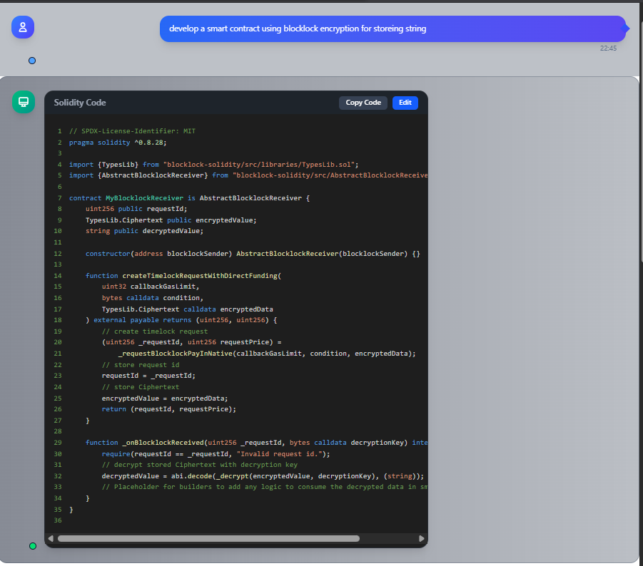
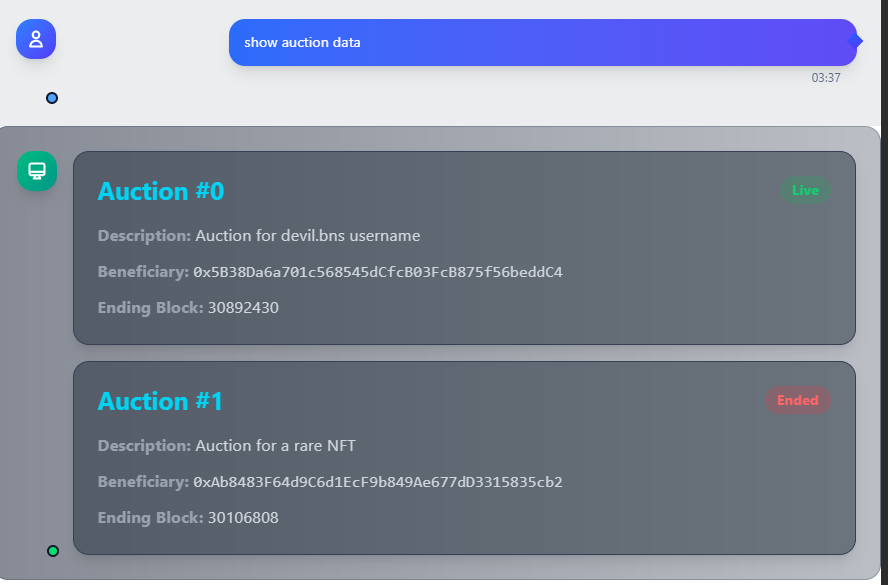
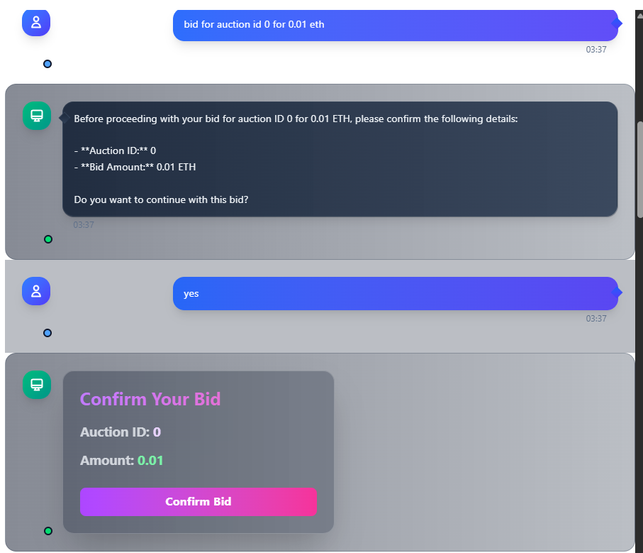

# 🧠 WALLET AI — Passkey MEV-Resistant Smart Wallet

---

# 🎥 Live Demo

[Watch the Live Demo on Youtube](https://youtu.be/2__2sPO4Rfc)

---

## 🌍 The Future of Web3 Wallets — Powered by Natural Language & Account Abstraction

**WALLET AI** is revolutionizing how users interact with blockchain. With a **built-in AI assistant**, **passkey-based authentication**, and full support for **ERC-4337 account abstraction**, it enables seamless, intuitive, and secure blockchain experiences — all in one click.

No mnemonic phrases. No gas fees to worry about. Just simple, fast, and secure access to decentralized finance, NFTs, and dApps — directly from your browser or Telegram.

---

## 🧩 Why WALLET AI?

> "Usability meets decentralization."

We believe blockchain should be accessible to everyone — not just developers. That’s why we’re building WALLET AI: to make interacting with Web3 as easy as typing a message.

By removing technical barriers and offering powerful new capabilities through AI, passkeys, and account abstraction, we are paving the way for true mass adoption.

Blockchain should be as universal and easy as using any everyday app, bringing decentralized access to everyone.

---

## 🔑 Key Features

- ✅ **AI Assistant:** Natural language-based transaction creation.
- ✅ **Account Abstraction:** ERC-4337 support (EntryPoint v0.6).
- ✅ **Passkeys (WebAuthn):** Secure, passwordless authentication (no mnemonics).
- ✅ **MEV Resistance:** Blocklock-encrypted transactions prevent front-running.
- ✅ **Gasless Transactions:** Powered by Paymaster & Bundler infra.
- ✅ **WalletConnect:** Plug-and-play with dApps.
- ✅ **Genesis Soulbound Token:** A unique, on-chain identity.
- ✅ **Batch Transactions:** Multiple operations in a single `UserOperation`.

---

## 🛡️ MEV Resistance via Blocklock

Maximal Extractable Value (MEV) is an invisible tax on users. WALLET AI combats this by integrating **dcipher’s Blocklock encryption**:

- **Encrypted Mempool:** Transactions are encrypted before hitting the mempool.
- **Commit-Reveal Scheme:** Encrypted transactions are committed first, decrypted later.
- **Just-in-Time Decryption:** Decryption happens only after block inclusion, ensuring no front-running.

### How It Works

1. User builds a transaction (e.g., swap) and enables **MEV Protection**.
2. Transaction data is encrypted with `blocklock-js`, set to unlock in the next block.
3. The wallet submits a `UserOperation` with `executeEncryptedBatch`.
4. Bundler includes it in a block; MEV bots see only opaque data.
5. Blocklock releases the decryption key after block finalization.
6. Wallet decrypts and executes the transaction — too late for MEV bots to exploit.

## 🛠️ Structure of a UserOperation

```solidity
struct UserOperation {
    address sender;             // The smart contract wallet (account abstraction account)
    uint256 nonce;              // Prevents replay attacks
    bytes initCode;             // Code to deploy the wallet if it doesn’t exist yet
    bytes callData;             // Encoded function call(s) the user wants to execute
    uint256 callGasLimit;       // Gas for the actual call execution
    uint256 verificationGasLimit; // Gas for validation logic
    uint256 preVerificationGas; // Gas to cover calldata + bundler overhead
    uint256 maxFeePerGas;       // Max fee per gas (like EIP-1559)
    uint256 maxPriorityFeePerGas; // Miner/validator tip
    bytes paymasterAndData;     // Info for Paymaster (gas sponsor, optional)
    bytes signature;            // Signature proving user authorization
}
```

---

## 🔑 Key Fields Explained

- **sender** → Your smart account address.
- **nonce** → Prevents replay (increments every operation).
- **initCode** → Deploys your wallet if it doesn’t exist yet (great for one-click onboarding).
- **callData** → The action (e.g., transfer tokens, swap, contract call).
  - ✅ _Here we are encrypting `callData` using **dCipher Blocklock encryption** to provide MEV resistance. The data stays hidden until a certain condition (like block height) is met, preventing front-running._
- **callGasLimit / verificationGasLimit** → Gas budgets for execution + validation.
- **preVerificationGas** → Pays bundlers for calldata overhead.
- **maxFeePerGas / maxPriorityFeePerGas** → Same as EIP-1559 gas pricing.
- **paymasterAndData** → Optional. If filled, a Paymaster can sponsor your gas.
- **signature** → Proof you approved this operation (can be passkey, multisig, threshold, etc.).

---

## 📄 Example UserOperation JSON

```json
{
  "sender": "0xYourSmartWallet",
  "nonce": "0x01",
  "initCode": "0x",
  "callData": "0xa9059cbb000000000000000000000000Recipient0000000000000000000000000000000000000001",
  "callGasLimit": "0x5208",
  "verificationGasLimit": "0x100000",
  "preVerificationGas": "0x30000",
  "maxFeePerGas": "0x59682f00",
  "maxPriorityFeePerGas": "0x59682f00",
  "paymasterAndData": "0x",
  "signature": "0xUserSignature"
}
```

This example represents a **token transfer** from an account abstraction wallet.

---

### 🤖 AI-Powered Smart Contract Deployment



- Integrated **AI Agent** that helps users generate and deploy **dCipher contracts**.
- Users can simply ask in natural language (e.g., _“create a simple Blocklock encryption contract with unlock logic”_).
- The generated contract is shown in an **editor** where users can review and edit before deployment.
- One-click deployment directly from the wallet.
- **Partial contract interaction implemented** (deploy + view supported, full interaction WIP).

---

## 🚧 Roadmap

- [ ] Full contract interaction (function calls, state reads)
- [ ] More advanced AI templates (auctions, voting, DAOs)
- [ ] Multi-chain deployment support

## 🚀 Previous week Integrations

[Week2 Live Demo on Loom](https://www.loom.com/share/7566d39131254596abd7bde968999c8f)
[Week3 Live Demo on Youtube](https://youtu.be/lKZnB0gOny0)

WALLET AI is more than a wallet — it’s an evolving ecosystem.

### ✅ Sealed-Bid Auctions with Blocklock Encryption

- Secret bids, revealed only after the auction ends.
- Prevents last-second bid manipulation.




### ✅ Encrypted Voting & Governance Portal

- Votes stay private until polls close.
- Prevents early voting influence and coercion.

### ✅ Time-Locked Messages

- Encrypt and send assets/messages into the future.
- Use cases: wills, digital time capsules, delayed disclosures.

### ✅ Bomb NFT

- NFTs with hidden encrypted messages revealed only after conditions unlock.
- Creates evolving NFT experiences.

### ✅ Gasless Transaction Status

- Real-time status of UserOperations.
- Transparency in how account abstraction processes your gasless transactions.

---

## 🏗️ Technical Architecture

**On-Chain Contracts**

- `SimpleAccount.sol` — Wallet contract with MEV-protection logic.
- `SimpleAccountFactory.sol` — Deterministic smart wallet deployment.
- `EntryPoint.sol` — Orchestrates ERC-4337 UserOps.

**Off-Chain Services**

- **Bundler** — Aggregates UserOps and submits them.
- **Blocklock Network** — Handles encryption/decryption key delivery.

**Frontend**

- Next.js app with passkey onboarding, AI assistant, and Blocklock SDK.

---

## 🌐 Roadmap

- 🔹 Expand AI agent capabilities (DeFi strategies, portfolio rebalancing).
- 🔹 Cross-chain support for Stacks, Mantle, Base, and more.
- 🔹 Integration of zkProofs for private transactions.
- 🔹 Community-driven governance via encrypted voting portal.

---
