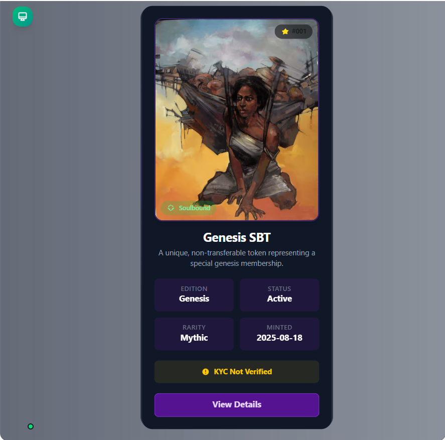

# 🧠 WALLET AI

> **Note**
>
> - The **Paymaster** and **Bundler** are currently running locally in **Docker**.
> - I am already working on **WALLET AI**, and I have now integrated **dcipher randomness** into it for **Soulbound NFT minting**

---

# 🎥 Live Demo

[Watch the Live Demo on Loom](https://www.loom.com/share/7566d39131254596abd7bde968999c8f)

## The Future of Web3 Wallets — Powered by Natural Language & Account Abstraction

**WALLET AI** is revolutionizing how users interact with blockchain. With a **built-in AI assistant**, **passkey-based authentication**, and full support for **ERC-4337 account abstraction**, it enables seamless, intuitive, and secure blockchain experiences — all in one click.

No mnemonic phrases. No gas fees to worry about. Just simple, fast, and secure access to decentralized finance, NFTs, and dApps — directly from your browser or Telegram.

---

## 🧩 Why WALLET AI?

> "Usability meets decentralization"

We believe blockchain should be accessible to everyone — not just developers. That’s why we’re building WALLET AI: to make interacting with Web3 as easy as typing a message.

By removing technical barriers and offering powerful new capabilities through AI and account abstraction, we are paving the way for true mass adoption.

The reason for WALLET AI is simple: blockchain is a technology that needs to be in **everyone’s hands, without borders**. Today, most users are still technically inclined people — but that needs to change. Blockchain should be as universal and easy as using any everyday app, bringing decentralized access to everyone.

---

## 🧩 Key Features

- ✅ Built-in AI assistant for natural language-based transactions
- ✅ Account Abstraction via ERC-4337 (supports EntryPoint v0.6)
- ✅ Passkey-based secure identity (no mnemonics)
- ✅ Seamless integration with Telegram Mini Apps
- ✅ WalletConnect support for plug-and-play dApp interaction
- ✅ Smart account creation & gas-efficient deployment
- ✅ Paymaster & Bundler setup for gasless transactions
- ✅ **Genesis Soulbound Token** for a unique, on-chain identity

---

## ✨ Your On-Chain Identity: The Genesis Token

Every AI wallet is born with a **Genesis Soulbound Token (SBT)** — a unique, non-transferable NFT that serves as your permanent on-chain identity. This isn't just a digital collectible; it's your wallet's "birth certificate," with unique traits generated by **dcipher's verifiable randomness**.

### How It Works

1. **One-Click Creation**: When you create a new wallet, our `SimpleAccountFactory` is called.
2. **Randomness Request**: The factory instantly triggers the `GenesisSBT` contract to request a verifiable random number from the dcipher network.
3. **Gasless Minting**: Thanks to our Paymaster, this entire process, including the minting of your SBT, is **completely gas-free** for you.
4. **Unique Traits**: Once the random number is securely delivered on-chain, your Genesis SBT is minted with a unique set of generative traits, including a visual "Cosmic Signature" and a special "Origin Title."

Currently, the minted Soulbound NFT is only attached to the wallet address.  
In the future, we plan to integrate **KYC using zkTLS proofs**, enabling on-chain verification that can be securely and privately added to the Soulbound NFT.  
This way, your on-chain identity evolves into a **trust-enhanced passport** for Web3, while preserving privacy and decentralization.

---

## 🎨 Genesis SBT NFT Details

Every WALLET AI identity begins with a **Genesis SBT** — your permanent proof of origin on-chain.

| Attribute     | Value            |
| ------------- | ---------------- |
| **Edition**   | Genesis          |
| **Status**    | Active           |
| **Rarity**    | Mythic           |
| **Minted On** | 2025-08-18       |
| **Soulbound** | Non-transferable |
| **KYC**       | Not Verified     |

The Genesis SBT is a **soulbound token**, meaning it **cannot be transferred** or sold. Instead, it anchors your wallet’s existence and represents your **unique membership** in the Wallet AI ecosystem.

Future updates will allow the NFT to **evolve dynamically**, integrating:

- ✅ KYC verification (via zkTLS proofs)
- ✅ Reputation-based traits & scores
- ✅ Credentials (DAO memberships, hackathon badges, certifications)
- ✅ Visual trait upgrades tied to on-chain activity

This makes your Genesis SBT not just an ID but a **living passport for Web3**.
